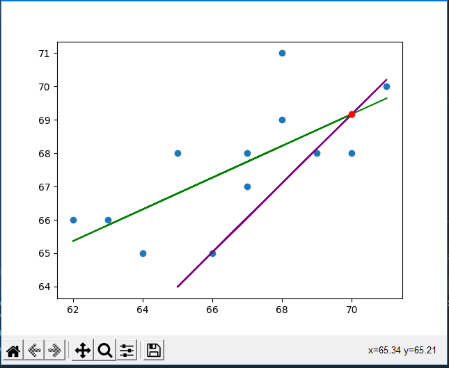

# Simple Linear Regression on python

## Librairies:

- Numpy
- Matplotlib
- Sklearn

## Dataset:

> y = np.array([68, 66, 68, 65, 69, 66, 68, 65, 71, 67, 68, 70])  
> x = np.array([65, 63, 67, 64, 68, 62, 70, 66, 68, 67, 69, 71])

## Result:

> Green --- y = (0.47637795) x + 35.82480314960628  
> Purple --- y\_ = (1.03640257) x + (-3.3768736616702313)  
> Inter ( 69.9999172, 69.1712204 )

